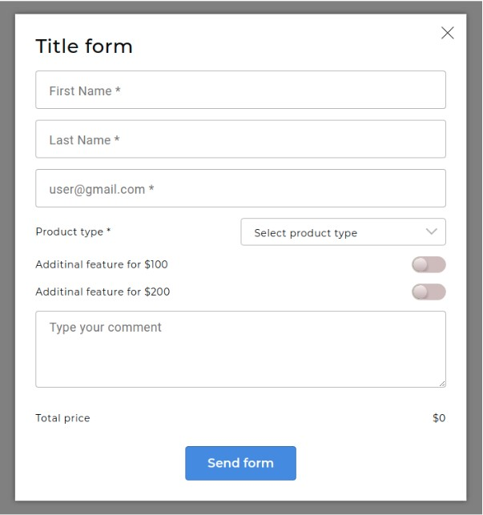

# Тестовое задание для Scrile
## Задача
Создайте форму в модальном окне со следующим содержанием:

### Требования (стажер/джун):
1. Данные формы должны отправляться корректно.
2. Верстка согласно представленному макету.
3. Модальное окно должно закрываться по кнопке закрытия окна..
4. У обязательных полей должна быть валидация перед отправкой.\
a. поля не должны быть пустыми\
b. email должен быть валидный
5. При изменение полей Product type и дополнительных функций должен производиться пересчет итоговой суммы.
6. Укажите в письме сколько времени вы потратили на выполнение задания.
7. Отправьте выполненное задание как ZIP-архив со всеми необходимыми файлами.
